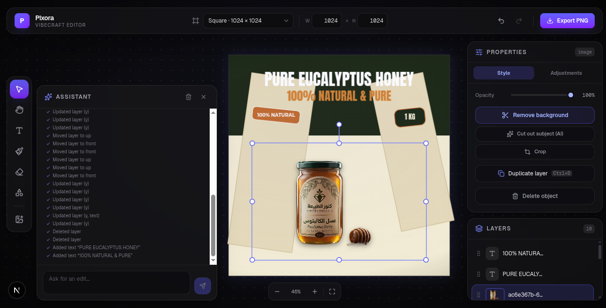
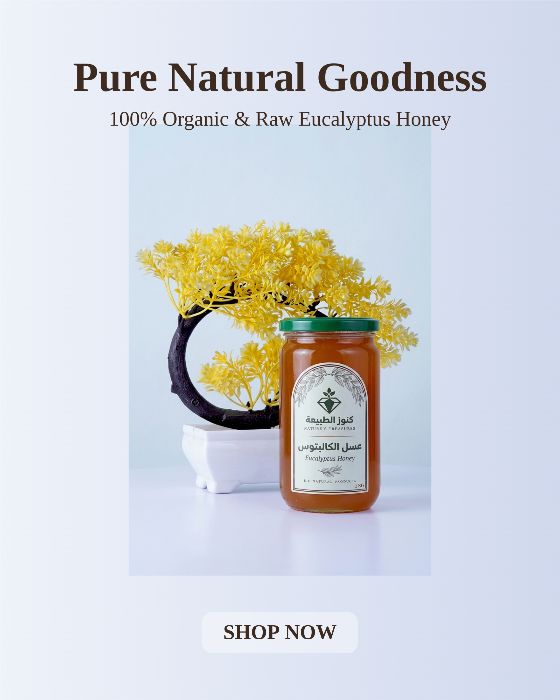

# PixoraPro - AI Agent-Powered Image & Canvas Editor

<div align="center">

  

  **Next-Generation Canvas & Image Editor Powered by Multi-Layer Autonomous AI Agents**

  [](https://nextjs.org/)
  [](https://react.dev/)
  [](https://www.typescriptlang.org/)
  [](https://fabricjs.com/)
  [](https://tailwindcss.com/)
  [](https://ai.google.dev/)

</div>

---

## 🌟 Overview

**Pixora (Vibecraft Editor)** is a web-based vector and raster canvas editing platform designed for modern product marketing, advertisement creation, and graphic design.

What makes Pixora unique is its **integrated, multi-layer AI Agent**. Instead of simple text-to-image prompts or isolated filters, Pixora's agent acts as a co-designer: it inspects your canvas layer tree, sees high-res visual screenshots, and executes structured tool calls in real time to perform complex multi-step design workflows directly on your canvas.

---

## 📸 Visual Showcase & Workflow

### 1. From Raw Product Photo to High-Converting Ad

Give the AI Assistant a single natural language instruction:
> *"I'm trying to sell this product so, create a good ad for it"*

| 1. Initial Raw Image Prompt | 2. Real-Time AI Agent Execution | 3. Finished Layered Design |
| :---: | :---: | :---: |
|  |  |  |
| *User uploads raw product photo and enters natural language goal.* | *Agent removes background, adds background cards, typography, badges & shadows.* | *Final editable layout with full layer stack and fine-grained controls.* |

---

### 2. High-Resolution Export Gallery

The agent automatically formats typography, colors, CTA buttons, and product placement tailored to specific branding requirements and languages (including RTL Arabic layout support):

<div align="center">

| Organic Honey Product Ad | Herbal Tea Campaign (Arabic RTL) | Smartwatch Product Ad (Dark Mode) |
| :---: | :---: | :---: |
|  |  |  |
| *Clean Minimalist Aesthetic* | *RTL Typography & CTA Buttons* | *Dark Mode & Vibrant Badges* |

</div>

---

## 🤖 AI Agent Operations & Toolset

Pixora's agent operates via a neutral protocol behind an `AgentTransport` interface. It executes over 20+ specialized tool operations directly on the Fabric.js canvas:

```
                  ┌──────────────────────────────────────────────┐
                  │              User Prompt                     │
                  └──────────────────────┬───────────────────────┘
                                         │
                                         ▼
                  ┌──────────────────────────────────────────────┐
                  │    AI Agent Engine (Gemini / Claude)          │
                  │    - Inspects Canvas Layer State             │
                  │    - Inspects Visual Canvas Screenshots       │
                  └──────────────────────┬───────────────────────┘
                                         │
                                         ▼
     ┌────────────────────────────────────────────────────────────────────────┐
     │                    Structured Canvas Tool Execution                    │
     ├───────────────────────┬────────────────────────┬───────────────────────┤
     │  Layer & Layout       │  Object Manipulation   │  Design & Styling     │
     │  - set_artboard       │  - remove_background   │  - add_text           │
     │  - place_in_card      │  - crop_image          │  - add_shape          │
     │  - align_layer        │  - adjust_image        │  - set_gradient       │
     │  - distribute_layers  │  - set_image_fit       │  - set_properties     │
     │  - arrange_grid       │  - duplicate_layer     │  - sample_color       │
     │  - move_layer (z-index)│ - delete_layer        │  - group / ungroup    │
     └───────────────────────┴────────────────────────┴───────────────────────┘
```

### Complete List of Agent Capabilities

- ✂️ **Client-Side AI Background Removal**: Isolates product subjects locally without external latency.
- 📐 **Artboard & Preset Management**: Dynamically sets custom canvas sizes (e.g. 1024x1024, Instagram Story, Social Banners) and background fills.
- 🎨 **Smart Background Card Framing**: Places products inside padded background cards with soft dropshadows (`place_in_card`).
- ✍️ **Multi-Lingual Typography & Alignment**: Adds styled headlines, subheaders, badges, and call-to-action (CTA) buttons with automatic RTL/LTR font alignment.
- 🎚️ **Image Adjustments**: Tweaks brightness, contrast, saturation, hue rotation, and blur filters.
- 🏗️ **Multi-Layer Z-Index & Alignment**: Aligns objects (left, center, top, bottom), distributes spacing evenly, groups elements, and re-orders z-index layers.
- 📸 **Visual Vision Feedback**: Uses live canvas screenshots to refine visual aesthetics turn-by-turn.
- ↩️ **Atomic Batch Undo**: Groups all agent steps per turn into a single undo/redo transaction.

---

## 🛠️ Editor UI Features


- **Interactive Canvas Engine**: Built on Fabric.js v7 with smooth object transformation handles, rotation, and selection.
- **Layer Panel**: Drag-and-drop layer reordering, lock, hide/show toggle, and layer naming.
- **Properties Sidebar**: Real-time property modification for text fonts, colors, opacity, border radius, stroke, shadow, and image filters.
- **Drawing Tools**: Freehand brush, pencil, eraser, shapes (rectangles, circles, stars, polygons), and text tools.
- **Project Export**: High-DPI PNG export and JSON canvas state saving.

---

## 🚀 Quick Start & Installation

### 1. Prerequisites
- **Node.js**: `v18.0.0` or higher
- **npm** (or `yarn` / `pnpm` / `bun`)

### 2. Clone & Install
```bash
git clone https://github.com/Amine136/PixoraPro.git
cd PixoraPro
npm install
```

### 3. Environment Configuration
Copy `.env.example` to create your local `.env.local` file:

```bash
cp .env.example .env.local
```

Add your AI provider key to `.env.local`:
```env
# Gemini API Key (Recommended for fast dev execution)
GEMINI_API_KEY=your_gemini_api_key_here

# Alternatively, set Anthropic API Key if using Claude
# ANTHROPIC_API_KEY=your_anthropic_api_key_here
```

### 4. Run Development Server
```bash
npm run dev
```

Open [http://localhost:3000](http://localhost:3000) in your browser.

---

## 📁 Project Architecture

```
PixoraPro/
├── public/
│   └── docs/                     # Documentation screenshots & exports
├── docs/
│   ├── agent-mode-plan.md        # AI Agent architecture specification
│   ├── agent-gateway.md         # Production gateway protocol guide
│   └── agent-eval.md            # Benchmark evaluation suite
├── src/
│   ├── app/
│   │   ├── api/agent/            # Agent API route (Gemini & Anthropic dev backends)
│   │   └── page.tsx              # Main editor application page
│   ├── components/
│   │   └── editor/               # Canvas, AgentPanel, TopBar, PropertiesPanel
│   └── lib/
│       ├── agent/                # Protocol, tool definitions, transport & client loop
│       └── editor/               # Fabric.js hook (useEditor) & state handlers
├── .env.example                  # Environment configuration template
└── README.md                     # Main repository documentation
```

---

## 📄 License

Private repository - All rights reserved.
